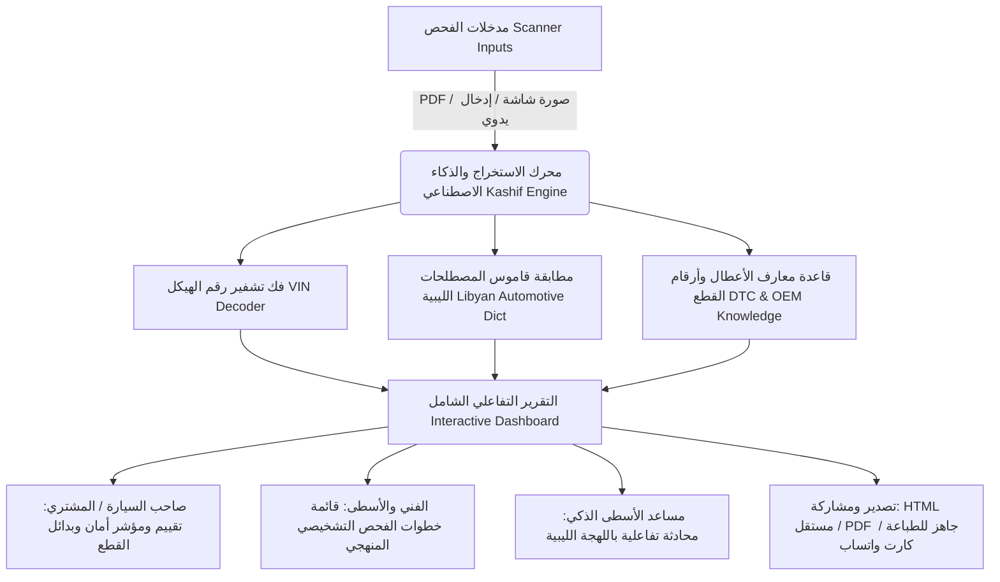
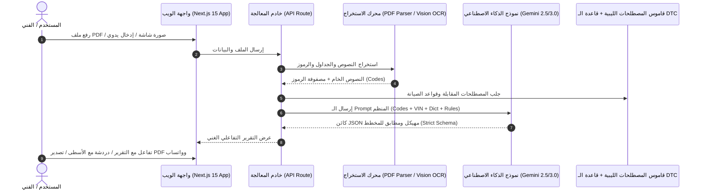

# وثيقة متطلبات المنتج (PRD)
# مشروع: كاشف الذكي (Kashif AI) — المساعد الذكي لتحليل تقارير أعطال السيارات بالهجة والمصطلحات الليبية

---

## 1. الملخص التنفيذي ورؤية المنتج (Executive Summary & Vision)

### 1.1 الرؤية (Product Vision)
**كاشف AI (Kashif AI)** هو تطبيق ويب ووكيل ذكاء اصطناعي تفاعلي متخصص في تحويل تقارير أجهزة فحص السيارات (OBD-II Scanners مثل Launch, Autel, Ediag, ThinkDiag, Topdon) من مستندات تقنية إنجليزية معقدة ومبهمة إلى **تقارير تفاعلية ذكية، مبسطة، ومحلية بالكامل**، تجمع بين الدقة الهندسية والمصطلحات الدارجة في الورش الليبية بالاعتماد على قاموس الصيانة الليبي المعتمد.

### 1.2 المشكلة وسياق السوق الليبي (Problem Statement)
1. **غموض تقارير الفحص**: تقارير أجهزة الفحص تخرج بلغة إنجليزية تقنية وأكواد مختصرة (مثل `P0102`, `02 Ignition Cyl 4`, `B2321`)، مما يجعل صاحب السيارة عاجزاً عن فهم حقيقة العطل.
2. **فجوة المصطلحات المحلية**: في السوق الليبي، لا يستخدم الفنيون والأسطوات المصطلحات العربية الفصحى أو الإنجليزية (مثلاً: لا يُقال "مكثف التكييف" بل "كندنساتوري"، ولا يُقال "فحمات الفرامل" بل "باطنيات"، ولا "مساعدات" بل "مزاطوري"، ولا "عمود الكامات" بل "امبروكم"). غياب هذه المصطلحات يسبب سوء فهم بين الزبون ومحل قطع الغيار والفني.
3. **ظاهرة التبديل العشوائي للقطع**: يقوم الكثير من الفنيين بتبديل الحساسات فور ظهور الكود دون إجراء فحوصات تسلسلية لكشف السبب الجذري (Wiring / Plugs / Vacuum Leaks).
4. **صعوبة مطابقة القطع ورقم الهيكل**: إيجاد رقم القطعة الأصلي (OEM Part Number) وصورتها الدقيقة لسيارات شائعة في ليبيا (كورية، يابانية، ألمانية، أمريكية) يستهلك وقتاً طويلاً.

### 1.3 القيمة المضافة الأساسية (Core Value Proposition)
- **فهم فوري شامل**: رفع تقرير الـ PDF أو تصوير شاشة جهاز الفحص للحصول على تقرير تفاعلي خلال ثوانٍ.
- **ترجمة هندسية ثلاثية الطبقات**: (مصطلح ليبي دارج ⇄ لغة عربية مبسطة ⇄ كود ومصطلح إنجليزي قياسي).
- **أرقام القطع الأصلية وصورها**: توليد أرقام قطع الغيار الأصلية (OEM) والبدائل الموثوقة مع صور توضيحية لسهولة شرائها من محلات بيع قطع الغيار أو السكراب.
- **مؤشر أمان وصحة السيارة (Health Score)**: تصنيف الأعطال حسب الخطورة (طوارئ توقف السيارة / خطورة متوسطة / أعطال راحة ثانوية).
- **مساعد الأسطى التفاعلي (AI Mechanic Chat)**: شات مدمج في التقرير يجيب على استفسارات المستخدم بلهجة ليبية واضحة ومباشرة.

---

## 2. شخصيات المستخدمين وسيناريوهات الاستخدام (User Personas & Use Cases)



### 2.1 شخصيات المستخدمين (Personas)
1. **صاحب السيارة / المشتري (Car Owner & Buyer)**:
   - *الهدف*: يريد فحص سيارة قبل شرائها أو فهم سبب إضاءة لمبة المحرك (Check Engine) أو ABS دون أن يتعرض للاستغلال.
   - *الاحتياج*: لغة واضحة، معرفة مدى خطورة قيادة السيارة، تكلفة تقديرية للقطع بالدينار الليبي، وأسماء القطع بالسوق.
2. **الأسطى وفني الورشة (Mechanic / Workshop Technician)**:
   - *الهدف*: قراءة سريعة لتقرير العطل، التأكد من الأنظمة المتأثرة، وخطوات فحص كهربائية وميكانيكية تسلسلية قبل فك القطع.
   - *الاحتياج*: قائمة تدقيق تشخيصية (Checklist)، أرقام القطع الأصلية OEM، والتحقق من التغذية والأسلاك (بيانتو / خيوط / فيوزات).
3. **الهاوي ومحب الصيانة الذاتية (DIY Auto Enthusiast)**:
   - *الهدف*: معرفة مكان القطعة، مخططها، وكيفية فحصها أو تبديلها بنفسه.

---

## 3. المواصفات الوظيفية للمنتج (Functional Specifications)

### 3.1 وحدة معالجة المدخلات واستخراج البيانات (Ingestion & Extraction Engine)
- **دعم ملفات الـ PDF الرقمية**: قراءة واستخراج النصوص والجداول من تقارير أشهر الأجهزة في ليبيا (Ediag, Launch X431, Autel MaxiSys, ThinkDiag, Topdon, Bosch KTS).
- **التعرف البصري على الصور (OCR & Vision AI)**: تحليل لقطات الشاشة أو الصور الملتقطة بكاميرا الهاتف لشاشات أجهزة الفحص ذات الإضاءة المتفاوتة.
- **الإدخال المباشر واليدوي**: واجهة لإدخال رقم الهيكل (VIN)، الصانع، الموديل، وسنة الصنع مع قائمة الرموز يدويًا أو عبر النسخ واللصق.
- **تجهيز مستقبلي لـ Bluetooth OBD-II**: واجهة برمجية معيارية تتيح لاحقاً الربط المباشر مع محولات ELM327 / OBDLink.

### 3.2 وحدة فك تشفير الهيكل والمواصفات (VIN Decoder & Vehicle Profiler)
- استخراج بيانات المركبة الأساسية آلياً:
  - الصانع (Make)، الموديل (Model)، وسنة الصنع (Year).
  - سعة المحرك ونوعه (Engine Displacement & Fuel: بنزين / نافطة - ديزل / هايبرد).
  - نظام الدفع والقير (Transmission: كمبيو أوتوماتيك / عادي / دبل).
  - بلد التجميع (Assembly Country) وحالة استدعاءات المصنع إن وجدت.

### 3.3 محرك التحليل والتعريب الليبي (Libyan Terminology & Diagnostic Engine)
يعتمد المحرك على الربط الصارم مع **قاموس مصطلحات صيانة السيارات الليبية** المكون من 12 تصنيفاً معتمداً:
1. **عام وإداري**: (سيرفيز، كشف، يد عاملة، صيانة وقائية، خدمة صالة، تسريب).
2. **السمكرة والطلاء**: (براونطي، كوفنو، رفرف، باسطة، رمالة، بوليش، تصفيح).
3. **الهيكل والمقصورة**: (باطنيات، ديسكو، طبلون، كوادرو، استبن، ماسكرينة، فنار، سطب، زافيترو، شنتورة، شريط إيرباق).
4. **المحرك ونقل الحركة**: (كاتينة، تستاتا، بسطوني، شنابر، بيّلا، كرونة، بوشي/ديفرنزيالي، كمبيو، كونفيرتا، عقل الكمبيو، صبورتوات المحرك والكمبيو، كاردان، بومبة، دينمو، موتورينو، رشاشات، مسطرة الرشاشات، بوبينة، طاقم فاصل، فرسيوني، بلاطو، سمياص، كوفية، كولوا، امبروكم، فولانو، قرسيوني كوبيركو، شمعات / شمعة، فيلترو نافطة).
5. **الحساسات ومنظومات الفحص الإلكتروني (OBD-II Sensors)**: (حساس الماف، حساس الماب، حساس الكولوا، حساس الامبروكم، حساس مرميطة علوي/سفلي، بوابة / راس انجكشن، سنسور راس الإنجكشن TPS، حساس هواء العجلات، بيانتو، علبة الفيوزات / فيوزات، فيوزيبيلي، لامبة تشك Check Engine، مورسيتي، تماتك).
6. **التبريد والزيوت والتكييف**: (كمبريسوري، كندنساتوري، رداتوري، مروحة الرداتوري، مناكوطي، توبو، ثلاجة التكييف، صمام انتشار، قربة، ترموستات، ليفلو، فيلترو، ستاقوبا).
7. **الفرامل ومنظومة العادم**: (فرينو، ريجسترو، بومبة فرينو، فرودي، طنبور، فرينو ماني، علبة كربون المرميطة، دبة الديزل DPF، فالف EGR، قربة الفحم EVAP، كاتم المرميطة، مرميطة، رقبة).
8. **التعليق والتوجيه (الصالة)**: (مزطوري، المزاطوري الهوائي، كوشينتي، كروتشيرة، سكاتولا، ستيرسو، بومبة ستيرسو، براتشو، فوزيلي، نوتشي، مسمار ميزان، بوكلة / بوكلات سيبورت الصالة، موتسو، باليسترا، ياي/مولا، قوميني، دفافات، ترصيص، ميزان).
9. **سيارات الهايبرد والكهرباء**: (بطارية الهايبرد، الانفرتر، بومبة ميه الانفرتر، فيلترو ومروحة بطارية الهايبرد).
10. **أدوات الورشة والتشخيص**: (جهاز كشف، كاتشافيتي، بينسة، قادوما، مورصة، كريك).
11. **عمليات وخدمات الورشة اليومية**: (تصفية محرك وشمعات، تسييخ رداتوري، خرط ديسكوات، غسيل كمبيو فلاش، تنظيف وبرمجة راس انجكشن، تصفير لامبة تشك).
12. **أقسام الورش**: (ورشة نافطة، ورشة بنزين، ورشة سمكرة وطلاء، دوبيو قابينا، أوطانطة).

### 3.4 هيكل وبطاقات التقرير التفاعلي (Interactive Report Structure)

| القسم في التقرير | المحتوى والوظيفة | الفائدة للمستخدم |
|---|---|---|
| **رأس التقرير (Header)** | شعار السيارة، رقم الـ VIN، الموديل والسنة، الممشى، تاريخ الفحص، ونوع جهاز الفحص. | توثيق رسمي وهوية واضحة للتقرير. |
| **مؤشر صحة السيارة (Health Score)** | مقياس بصري دائري (0 - 100%) مع شارة ملونة: <br>🟢 ممتاز / 🟡 يحتاج متابعة / 🔴 عطل حرج. | تقييم فوري بنظرة واحدة لحالة المركبة. |
| **مصفوفة الأولويات (Priority Matrix)** | تصنيف الأعطال إلى 3 مستويات: <br>1. حرج وعاجل (لا تقود السيارة)<br>2. متوسط (صيانة قريبة)<br>3. طفيف / تاريخي (Historical). | تحديد ما يجب إصلاحه أولاً لتفادي تفاقم الضرر. |
| **بطاقات الأعطال التفصيلية (Code Cards)** | بطاقة لكل كود تشمل: <br>- الكود الرسمي والاسم الفني<br>- الاسم والشرح باللهجة الليبية الفصيحة<br>- الأعراض المحسوسة (تقطيع، دخان، عزم طايح)<br>- الأسباب الجذرية المحتملة | فهم دقيق للمشكلة بدون تعقيد تقني. |
| **دليل قطع الغيار (Spare Parts Guide)** | لكل عطل: <br>- اسم القطعة بالليبي والإنجليزي<br>- رقم القطعة الأصلي (OEM Part #) والبدائل (Bosch/Denso)<br>- صورة ومخطط توضيحي للقطعة<br>- نطاق السعر التقديري بالدينار الليبي (LYD) | معرفة ما سيتم شراؤه وتكلفته قبل الذهاب للسوق. |
| **قائمة فحص الأسطى (Diagnostic Checklist)** | خطوات تدريجية تفاعلية للورشة (فحص الفيوز، قياس الفولتية، فحص التسريب قبل التغيير). | منع التبديل العشوائي وتوفير المال. |
| **مساعد الأسطى الذكي (AI Mechanic Chat)** | نافذة محادثة تفاعلية مدمجة تسأل فيها الذكاء الاصطناعي عن التقرير بلهجة ليبية. | إجابة على أي استفسار مخصص فوريًا. |
| **أدوات التصدير والمشاركة (Export Bar)** | - تصدير HTML مستقل (يعمل بدون إنترنت)<br>- تصدير PDF مجهز للطباعة والتوقيع<br>- زر "مشاركة عبر واتساب" مع رسالة ملخصة منسقة | سهولة إرسال التقرير للزبون أو الأسطى أو المشتري. |

---

## 4. المعمارية التقنية وتدفق النظام (Technical Architecture)



### 4.1 المكدس التقني (Tech Stack)
- **Frontend & App Shell**: Next.js 15 (App Router), React 19, TypeScript.
- **Styling & UI Components**: Tailwind CSS v4, Lucide Icons, Framer Motion (للحركات والانتقالات السلسة)، Shadcn-inspired clean aesthetics.
- **AI & Reasoning Core**: Google Gemini 2.5 / 3.0 Flash / Pro عبر Google Gen AI SDK مع دعم Multi-modal Vision للصور والـ PDFs.
- **Data Parsing & OCR**: `pdf-parse` / `pdfjs-dist` للمستندات الرقمية + Gemini Vision OCR للصور.
- **State & Local Storage**: IndexedDB / LocalStorage لحفظ سجل الفحوصات والتقارير محلياً على جهاز المستخدم للخصوصية والسرعة.
- **Export Engine**: `@react-pdf/renderer` أو `html2pdf.js` / Print Stylesheets لتوليد ملفات PDF نقية بدقة عالية متوافقة مع الطباعة وعرض الشاشة.

---

## 5. هيكل البيانات ومخطط الـ JSON (Data Schemas)

نموذج استجابة الذكاء الاصطناعي الصارم (Strict Structured Output Schema):

```typescript
interface KashifDiagnosticReport {
  reportId: string;
  generatedAt: string;
  scannerInfo: {
    toolName: string; // e.g. "Ediag", "Launch X431", "Autel MaxiSys"
    serialNumber?: string;
    testTime?: string;
  };
  vehicle: {
    vin: string;
    make: string;
    model: string;
    year: number | string;
    mileage?: string;
    engineSpecs?: {
      displacement?: string;
      fuelType: "بنزين" | "نافطة / ديزل" | "هايبرد" | "كهرباء";
      cylinders?: number;
      transmission?: string;
    };
  };
  summary: {
    overallHealthScore: number; // 0 - 100
    severityStatus: "حرج / خطر" | "متوسط / انتبه" | "سليم / خفيف";
    briefSummaryArabic: string; // ملخص بلهجة ليبية فصيحة ومفهومة
    systemsCheckedCount: number;
    faultsFoundCount: number;
    passedSystemsCount: number;
  };
  faultCategories: {
    criticalFaults: DiagnosticCodeDetail[];
    moderateFaults: DiagnosticCodeDetail[];
    minorOrHistoricalFaults: DiagnosticCodeDetail[];
  };
  passedSystems: {
    systemCode: string;
    systemNameArabic: string;
    systemNameEnglish: string;
  }[];
  sparePartsRequired: SparePartItem[];
  workshopChecklist: DiagnosticStep[];
}

interface DiagnosticCodeDetail {
  code: string; // e.g. "P0102", "CB", "21"
  module: string; // e.g. "ECM", "TCM", "ABS", "SRS", "LCM"
  moduleNameArabic: string; // e.g. "كمبيوتر المحرك", "كمبيوتر الكمبيو", "منظومة الفرامل ABS"
  standardDescriptionEn: string;
  libyanTerm: string; // e.g. "حساس الماف (فيلترو الهواء)"
  standardArabicDescription: string;
  driverSymptoms: string[]; // e.g. ["ضعف في العزم", "تقطيع أثناء المشي", "صرفية بنزين زايدة"]
  rootCauses: string[]; // الأسباب الجذرية
  urgencyLevel: "عالي جداً" | "متوسط" | "منخفض";
  impactOnVehicle: {
    safety: "عالي" | "متوسط" | "منخفض";
    fuelEconomy: "متأثر" | "غير متأثر";
    drivability: "خطر على المحرك" | "عزم ضعيف" | "قيادة طبيعية";
  };
  recommendedAction: string;
}

interface SparePartItem {
  id: string;
  relatedCode: string;
  partNameLibyan: string; // e.g. "حساس ماف (حساس الهواء)"
  partNameStandardArabic: string;
  partNameEnglish: string;
  oemPartNumber: string; // e.g. "22204-22010"
  aftermarketReplacements: string[]; // e.g. ["Denso 197-6030", "Bosch 0280218xxx"]
  estimatedPriceRangeLYD: {
    min: number;
    max: number;
    marketNote: string; // e.g. "جديد تجاري أو سكراب أصلي في سوق الجمعة/الدائري"
  };
  diagramCategory: "المحرك" | "الفرامل" | "التعليق والصالة" | "الكهرباء" | "التبريد";
  partImageUrl?: string;
}

interface DiagnosticStep {
  stepNumber: number;
  targetComponent: string;
  actionRequiredLibyan: string; // e.g. "قيس تغذية الخيوط (البيانتو) بـ الأفوميتر وتأكد من الفيوز قبل ما تغير الحساس"
  toolNeeded: string; // e.g. "أفوميتر / جهاز كشف"
}
```

---

## 6. قواعد واستراتيجية ضبط اللهجة والمصطلحات (Dialect & Prompt Strategy)

### 6.1 ميثاق التعبير اللغوي (Linguistic Tone Guidelines)
1. **الوقار الهندسي مع القرب البسيط**: الأسلوب يحاكي "مهندس فحص ليبي محترف يشرح لصاحب السيارة بكل احترام ووضوح".
2. **منع الترجمة الحرفية الجافة**: عدم استخدام ترجمات جوجل الآلية المضللة (مثل ترجمة "Camshaft" إلى "عمود الحدبات" دون ذكر "الامبروكم"، أو ترجمة "Shock Absorber" إلى "ممتص صدمات" دون ذكر "المزاطوري").
3. **التشديد على منظومة الصالة والتعليق**:
   - `Control Arm` ➔ **براتشو / دراع**
   - `Ball Joint` ➔ **فوزيلي**
   - `Tie Rod End` ➔ **نوتشي**
   - `Sway Bar Link` ➔ **مسمار ميزان**
   - `Bushing` ➔ **جلب / قوميني**
   - `Wheel Bearing` ➔ **كوشينتي العجلة**
4. **التشديد على منظومة المحرك والكهرباء**:
   - `Spark Plugs` ➔ **شمعات / شمعة**
   - `Ignition Coils` ➔ **بوبينات**
   - `Wiring Harness` ➔ **بيانتو / خيوط**
   - `Fuse Box` ➔ **علبة الفيوزات / فيوزات**
   - `Valve Cover Gasket` ➔ **قرسيوني كوبيركو**
   - `Serpentine Belt` ➔ **شنقة المحرك**

---

## 7. تصميم واجهات المستخدم وتجربة الاستخدام (UI/UX Specification)

### 7.1 نظام التصميم (Design System Tokens)
- **الاتجاه والخطوط**:
  - الاتجاه الافتراضي: **RTL (من اليمين لليسار)** لدعم اللغة العربية كأولوية قصوى.
  - خط العناوين والنصوص: **IBM Plex Sans Arabic** أو **Cairo / Tajawal** للوضوح وقوة القراءة على الشاشات والمطبوعات.
  - خط الأكواد والأرقام: **JetBrains Mono** أو **Geist Mono** لأرقام الـ VIN وأكواد الـ DTC.
- **لوحة الألوان (Color Palette)**:
  - الخلفية العامة: `Dark Slate (#090D16)` للوضع الداكن الفخم / `Clean Off-white (#F8FAFC)` للوضع الفاتح.
  - لون الإبراز الأساسي (Primary Accent): **Cyan Electric (`#0EA5E9`)** أو **Amber Mechanic (`#F59E0B`)**.
  - مؤشرات الخطورة:
    - 🔴 حرج (Critical Danger): `#EF4444`
    - 🟡 تحذير (Moderate Warning): `#F59E0B`
    - 🟢 سليم / منخفض (Safe & Nominal): `#10B981`
    - 🔵 نظام إلكتروني / معلوماتي (Info/ECU): `#3B82F6`

### 7.2 تدفق الصفحات والشاشات (Screen Flow)
1. **شاشة الرفع والبدء (Dropzone & Scanner Ingest)**:
   - منطقة سحب وإفلات لملفات PDF مع دعم المعاينة الفورية.
   - زر التقاط بالكاميرا (للموبايل) أو رفع صورة لشاشة جهاز الفحص.
   - تبويب للإدخال اليدوي المباشر السريع.
   - بطاقات أمثلة سريعة جاهزة للتجربة (BMW 528i, Toyota Corolla).
2. **شاشة المعالجة التفاعلية (Real-time Diagnostic Progress)**:
   - شريط تقدم ذكي يوضح مراحل التحليل:
     - 🔍 *استخراج الأكواد ورقم الهيكل...*
     - 🚗 *فك تشفير مواصفات السيارة...*
     - 📖 *مطابقة المصطلحات بالقاموس الليبي...*
     - ⚙️ *تحديد أرقام القطع وخطوات الفحص...*
3. **لوحة عرض التقرير النهائي (Interactive Diagnostic Report View)**:
   - **بطاقة المركبة العلوية** مع مقياس الصحة العام (Gauge).
   - **تبويبات الفلترة**: (الكل / الأعطال الحرجة / المحرك / الصالة والتعليق / الفرامل / الكهرباء / الأنظمة السليمة).
   - **شبكة البطاقات التفاعلية (Fault Cards)** مع ميزة التوسيع (Accordion) لعرض الأعراض، الأسباب، والقطع.
   - **درج قطع الغيار (Spare Parts Drawer)** مع أزرار نسخ رقم الـ OEM والبحث المباشر.
   - **الزر العائم لمساعد الأسطى (Floating AI Mechanic Chat)** لمحادثة فورية وسؤال الأسطى عن أي تفصيل.
   - **شريط التصدير العلوي والسفلي**: (تحميل PDF / نسخ رابط التقرير / إرسال كارت واتساب).

---

## 8. خارطة الطريق ومراحل التنفيذ (Implementation Roadmap)

| المرحلة | المدة التقديرية | المخرجات الرئيسية |
|---|---|---|
| **المرحلة 1: بناء النواة والمحلل الأساسي (MVP)** | أسبوع 1 | - إعداد مشروع Next.js 15 مع Tailwind والقاموس.<br>- معالجة ملفات PDF واستخراج أكواد OBD-II.<br>- توليد وعرض تقرير HTML تفاعلي مبسط باللهجة الليبية. |
| **المرحلة 2: التكامل البصري والـ OCR وأرقام القطع** | أسبوع 2 | - دعم رفع الصور والسكرين شوت عبر Gemini Vision.<br>- فك تشفير رقم الـ VIN واستخراج مواصفات المحرك بدقة.<br>- جلب أرقام القطع الأصلية OEM والصور التوضيحية.<br>- تحسين تصميم التصدير للـ PDF ورسائل الواتساب. |
| **المرحلة 3: مساعد الأسطى والتحسينات المتقدمة** | أسبوع 3 | - دمج شات "مساعد الأسطى الذكي" التفاعلي داخل التقرير.<br>- دعم التخزين المحلي للتقارير ومقارنة سجل الفحوصات.<br>- تحسين تجربة الموبايل ودعم الاستخدام كـ PWA دون إنترنت. |
| **المرحلة 4: الربط المجتمعي وأجهزة الـ Bluetooth (Future)** | لاحقاً | - إضافة قراءة البلوتوث المباشرة من ELM327.<br>- بوابة لمشاركة التقارير مع مجتمع ومحلات قطع الغيار في ليبيا. |

---

## 9. معايير القبول وضمان الجودة (Quality Assurance & Acceptance Criteria)

1. **دقة استخراج الأكواد (Extraction Accuracy)**:
   - يجب أن يتعرف النظام على 100% من أكواد الـ DTC القياسية وتنسيقات الأجهزة المختلفة (مثل تقارير Ediag المرفقة للـ BMW والـ Corolla).
2. **الالتزام بالقاموس الليبي (Dictionary Compliance)**:
   - منع استخدام الكلمات غير المستعملة محلياً واستبدالها بنسبة 100% بالمصطلحات الليبية المعتمدة في الملف المرجعي.
3. **أمان النصائح والتشخيص (Diagnostic Safety)**:
   - التنبيه الواضح على عدم استبدال الحساسات قبل فحص خطوط الكهرباء (البيانتو) وتنظيف الثروتل أو فحص التهريب لتجنب الخسائر.
4. **سرعة الاستجابة وتجربة المستخدم (Performance & UX)**:
   - زمن توليد التقرير لا يتجاوز 5 إلى 10 ثوانٍ من لحظة رفع الملف.
   - دعم كامل للشاشات الصغيرة (الموبايل) واستجابة تامة للـ RTL.
